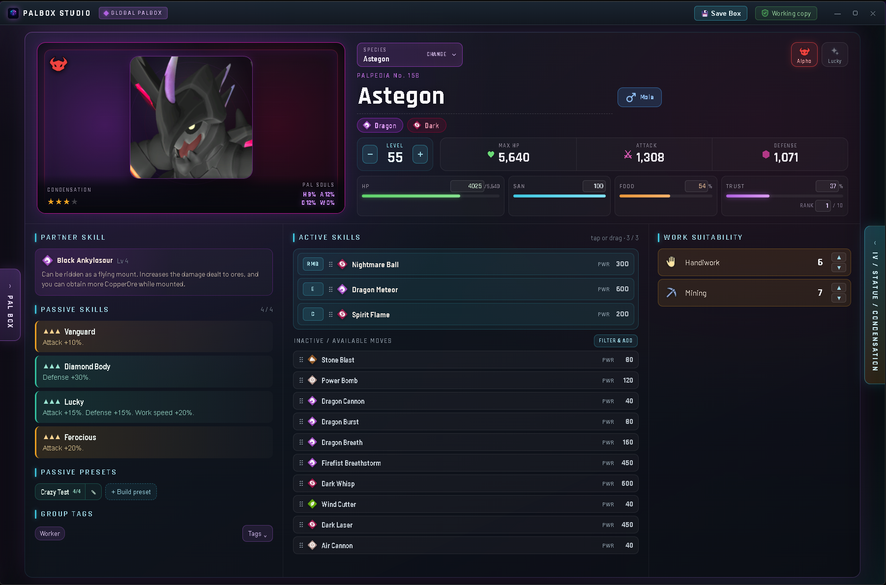
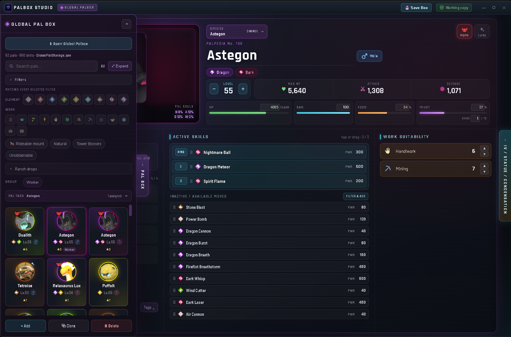
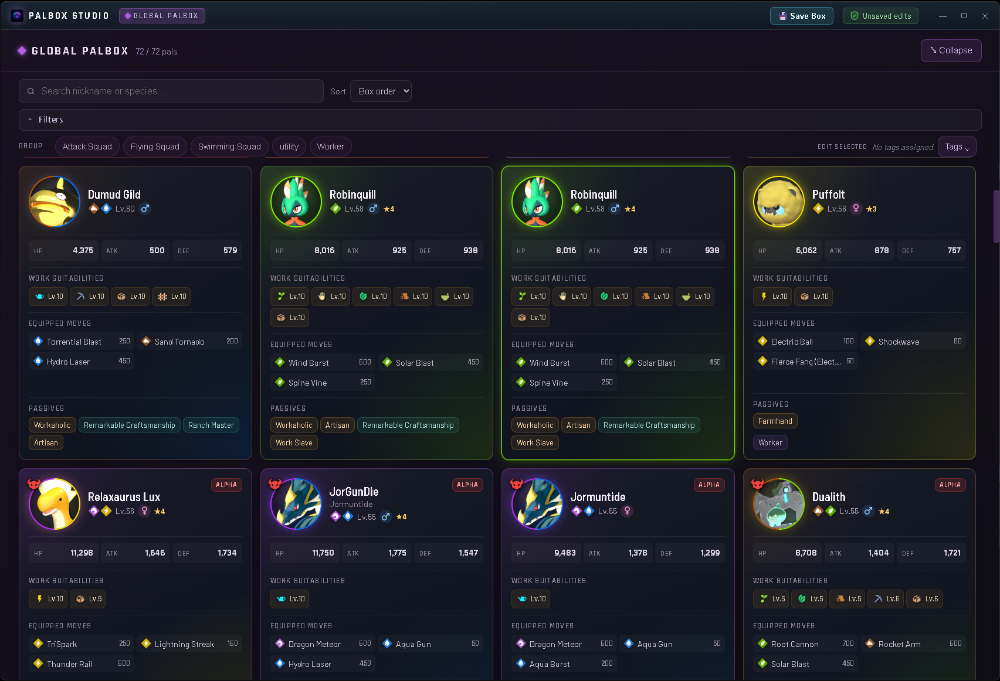
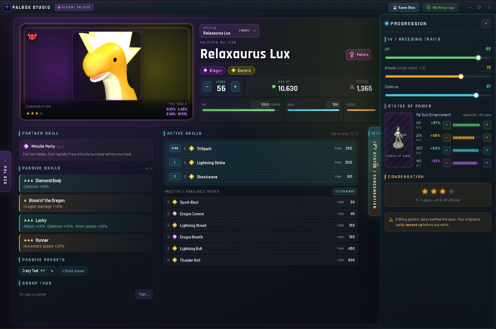
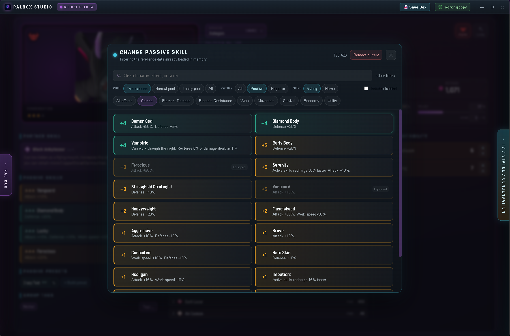
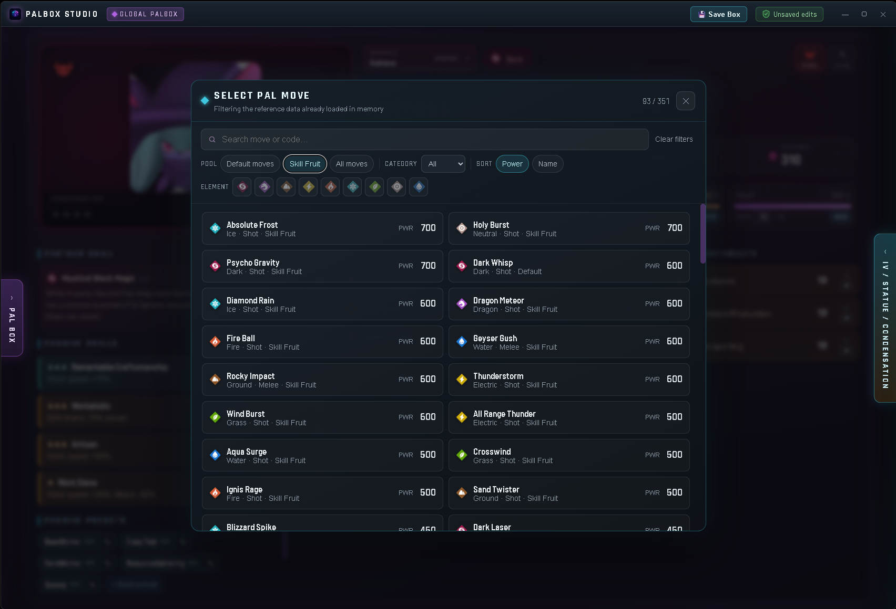

<h1 align="center">Palbox Studio</h1>

<p align="center"><strong>A desktop editor for the Palworld&nbsp;1.0 Global Palbox.</strong></p>

<p align="center">
  
  
  
  
</p>

<p align="center">
  <!-- SCREENSHOT: the main editor card, a pal loaded -->
  
</p>

Palbox Studio is a desktop application for editing the Global Palbox in Palworld 1.0 save files. It
reads `GlobalPalStorage.sav` directly, presents every Pal in the box, and gives full control over each
Pal's attributes through a native interface. It runs as a standalone application: it does not modify
the game, install into Palworld, or place files in the game directory. Every save operation writes a
verified backup before it touches the original file.

Palbox Studio is scoped to the **Global Palbox** only. It does not edit world saves, bases, or party
Pals.

---

## ✨ Features

- 🐾 **Full Pal editing** — species, nickname, gender, level, IVs, Pal Souls, condensation, passive
  skills, active and learned moves, work suitabilities, and the Lucky and Alpha flags.
- 📦 **Box explorer** — a side panel listing every Pal in the box, or an expanded full-gallery view.
- 🔍 **Filtering and search** — by element, work suitability, ride/mount capability, ranch drops, and
  obtainability, with a name and species search.
- 🏷️ **Groups and tags** — user-defined groups for organizing and filtering Pals.
- 🔄 **Species selector** — easily change any Pal's species with a searchable, filterable picker.
- ➕ **Add, clone, and remove** Pals.
- 💾 **Verified backups** — each save writes a checked backup, then replaces the original atomically.

All species, stats, moves, Partner Skills, and ranch products are rendered from a bundled game-data
database, so displayed values match Palworld 1.0.

---

## 🖼️ Overview

### 📂 Open your box
Click **Open Global Palbox** and choose your `GlobalPalStorage.sav`. Your whole box loads into the
side panel, ready to browse and edit — and a verified backup is written before any save.

### 📦 The Global Pal Box
A side panel lists every Pal in the box with search, filters, and tags for quick navigation. Select a
Pal to load it into the editor.

<p align="center">
  
</p>

### 🔎 Expanded view
The box expands into a full gallery, with each Pal shown as a card carrying its stats, moves, and
passives.

<p align="center">
  
</p>

### 🎴 The editor
The selected Pal is presented on a single card: portrait, typing, stats, Partner Skill, passives,
moves, and work suitabilities.

<p align="center">
  
</p>

### 📊 Editable stats
IVs, Pal Souls, condensation, level, and work suitabilities, with clear readouts and support for the
extended values reachable in Palworld 1.0.

<p align="center">
  
</p>

### 🔄 Species selector
Easily change any Pal's species with a searchable, filterable picker. Pick a new one and the card
updates to match.

<p align="center">
  
</p>

### ⚡ Passive skills
Assign passive skills from a searchable, filterable list to find the exact passive you want.

<p align="center">
  
</p>

### 🎯 Moves
Choose active skills from a filterable list, with each move's element and power shown.

<p align="center">
  
</p>

---

## ⬇️ Installation

Download the latest build from the [Releases](../../releases) page or from Nexus Mods.

- **Installer** — run `PalboxStudio-<version>-setup.exe`. It creates a Start-menu shortcut and
  installs the WebView2 runtime if it is not already present.
- **Portable** — unzip `PalboxStudio-<version>-portable.zip` and run `Palbox Studio.exe`. No
  installation is required; keep the folder contents together.
- **Vortex** — the portable folder can be registered as a Vortex tool: on the Palworld dashboard,
  **+ Add Tool → New…**, and set **Target** to `Palbox Studio.exe`. Full steps are in the zip's
  `READ ME FIRST.txt`.

Windows 11 includes the required WebView2 runtime. On earlier versions of Windows, install the
Microsoft Edge WebView2 Runtime if the application does not start.

### 🛡️ A note on antivirus / SmartScreen
Palbox Studio is not code-signed, so Windows SmartScreen or antivirus software may warn about it the
first time you run it. This is expected for unsigned, independent software. The complete source is in
this repository — you are welcome to review it, and to build the application yourself (see
[Building from source](#building-from-source)) rather than run a prebuilt binary.

### 💾 Save safety
- A verified backup is written before any save modifies your file.
- Close Palworld before saving edits.
- The Global Palbox is located at `%LOCALAPPDATA%\Pal\Saved\SaveGames\<id>\GlobalPalStorage.sav`.
- Keeping an independent copy of important saves is recommended.

---

## Building from source

Requirements: Rust (stable-msvc) and Node.

```bash
npm install && npm --prefix ui install   # one-time
npm run tauri dev                          # run with UI hot-reload
```

`npm run build` builds the frontend, `cargo test` runs the engine tests, and
`python scripts/build_reference_db.py --check` validates the reference database.

To produce the installer and portable zip:

```powershell
powershell -ExecutionPolicy Bypass -File scripts/build-release.ps1
```

## 🧩 Architecture

- **`core/`** — `palbox-core`, a headless Rust engine: the Palworld 1.0 save model, load/write,
  and edit operations, with verified 1.0 limits and unit tests against real save data.
- **`src-tauri/`** — the Tauri 2 desktop shell bridging the engine to the UI.
- **`ui/`** — the Svelte 5 + Vite frontend.
- **`database/` + `data/`** — a bundled, read-only SQLite reference database (species, moves,
  passives, Partner Skills, ranch products, localization) loaded into memory at startup, and a
  writable user database for groups, tags, and presets.

Architecture decisions are documented in [`docs/decisions/`](docs/decisions).

## 🙏 Acknowledgements

Palbox Studio builds on prior Palworld 1.0 save-editing work by the community. Save serialization
uses the [`uesave`](https://github.com/oMaN-Rod/uesave-rs) library. Inspired by PalEdit. Palworld is a trademark of
Pocketpair, Inc. Palbox Studio is an unofficial, fan made, independent tool.

## 📄 License

Palbox Studio is source-available under the [PolyForm Strict License 1.0.0](LICENSE). It is free to
download and use. Redistribution, and modified or derivative versions, are not permitted without
written permission from the author. For collaboration or reuse inquiries, please open an issue.
